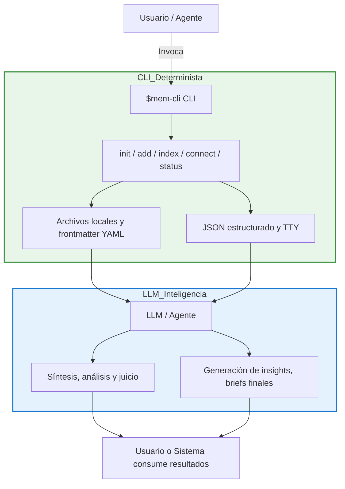

# $mem-cli — CLI de memoria
# Concepto

`$mem-cli` es un skill local diseñado para operar una memoria local de proyecto, capturando archivos, indexando relaciones, generando conexiones y briefs. La inteligencia permanece delegada al LLM.

# Instalación Local

```bash
git clone <repo_url> mem-cli
cd mem-cli
bash scripts/install-local-skill.sh
```

Opcional: variables de entorno:

```bash
export MEM_CLI_VAULT=/path/to/mem-cli-vault
export MEM_CLI_TMP=.tmp
```

# Estructura de la Bóveda

```
mem-cli-vault/
├── 00-INBOX/
├── 01-CAPTURES/
├── 02-CONNECTIONS/
├── 03-BRIEFS/
├── docs/
└── .tmp/
```

# Comandos CLI

| Comando  | Descripción            | Inputs            | Output |
| -------- | ---------------------- | ----------------- | ------ |
| init     | Inicializa la bóveda   | --vault           | JSON   |
| add      | Captura archivos       | Archivos/Carpetas | JSON   |
| index    | Indexa archivos        | Carpeta/Bóveda    | JSON   |
| connect  | Conexiones heurísticas | --days, --tags    | JSON   |
| brief    | Genera resumen         | --topic           | JSON   |
| status   | Estado de la bóveda    | Ninguno           | JSON   |

# Frontmatter YAML para archivos capturados

```yaml
---
created: 2026-05-17T12:00:00Z
type: source | capture | connection | brief
status: new | processed | linked
source: local | external
tags: [tag1, tag2]
source_file: path/to/file
---
```

# Flujo de Uso Recomendado

```bash
$mem-cli init --vault ./mem-cli-vault
$mem-cli add ./src ./docs
$mem-cli index --vault ./mem-cli-vault
$mem-cli connect --vault ./mem-cli-vault --days 7
$mem-cli brief --vault ./mem-cli-vault --topic "refactor patterns"
$mem-cli status --vault ./mem-cli-vault
```

# Diagrama de flujo CLI ↔ LLM



# Reglas de Inteligencia

- Los briefs y conexiones se consideran borradores: el LLM/Agente debe revisar antes de tomar decisiones.
- Conexiones útiles detectan:
    - Principios subyacentes compartidos
    - Contradicciones entre archivos
    - Patrones repetidos o dependencias
- Campos de briefs: `ONE THING`, `PROOF`, `READER TRANSFORMATION`, `THREE HOOKS`, `THREE CLOSERS`.

# Restricciones de Diseño

- Operaciones primero locales y deterministas.
- Salida JSON para agentes, legible para TTY.
- Scripts CLI pequeños, explícitos y composables.
- La documentación de referencia vive en `docs/`.
- Mantener manifiestos y contratos estáticos en `references/`.

# Iteración y Mejora

- Inicial: `init`, `add`, `status`.
- Segunda fase: `index`, `connect`.
- Fase avanzada: `brief` con LLM para resúmenes y análisis.
- Seguridad: integrar reglas de escaneo deterministas antes de procesar archivos.
- Evolución: almacenar en `skills/` como skill reusable y versionado.

# Ejemplo JSON de salida (`brief`)

```json
{
  "topic": "refactor patterns",
  "one_thing": "Duplicated code detected across modules",
  "proof": ["module_a.py: lines 12-30", "module_b.py: lines 5-25"],
  "reader_transformation": "Identificar oportunidades de refactor para DRY",
  "three_hooks": ["Duplicación evidente", "Impacto en mantenibilidad", "Posible automatización"],
  "three_closers": ["Priorizar módulos críticos", "Revisar pruebas unitarias", "Plan de integración"]
}
```